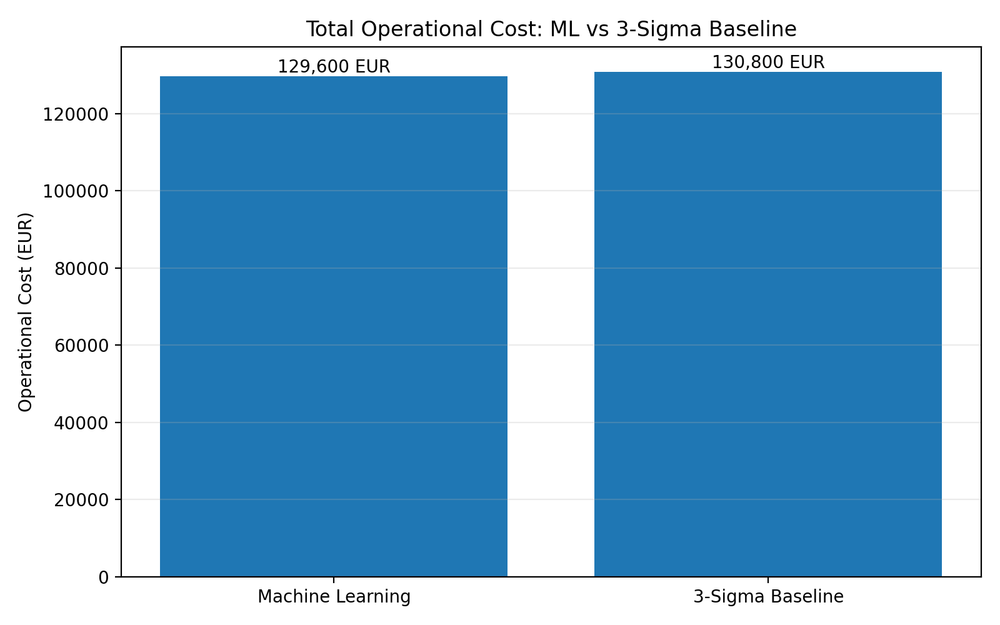
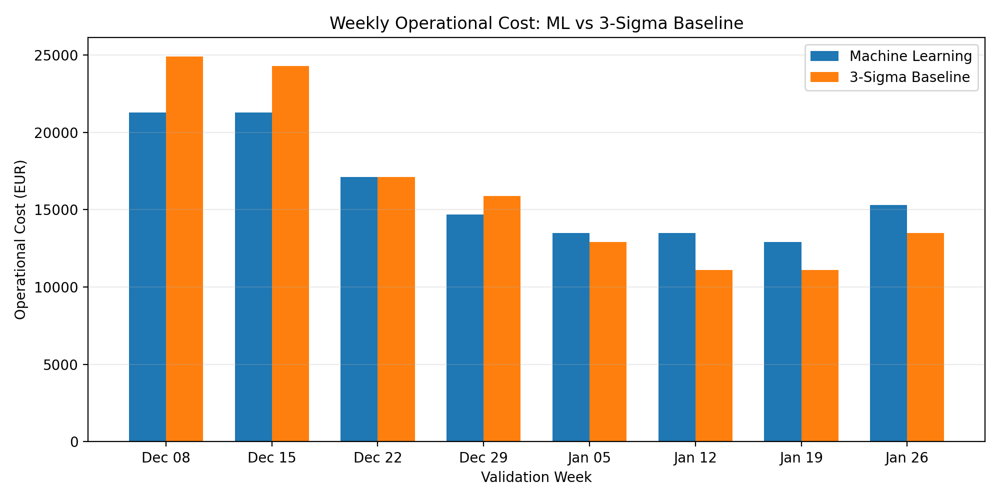

# LPDG x RGM Innovation Challenge — Machine Learning

This repository contains my solution for the **LPDG x RGM Innovation Challenge 2026**, using the **Machine Learning** track.

The main goal of the project is to help the field team decide which gateways should be visited first when only **15 site visits are available per week**.

---

## Project Demo

A short screen recording showing my approach, implementation, evaluation, prediction pipeline, and final validation:

[Watch the Project Demo](https://drive.google.com/file/d/1Qca6lUQYkmXHX2T3WO3Z0TEneHrBiyTJ/view?usp=sharing)

---

## 1. Problem I Worked On

There are around 320 gateways, but the field team can visit only 15 gateways in a week.

The challenge is therefore a ranking problem:

> Given the information available up to a particular week, which 15 gateways should be visited first?

The cost of making a wrong decision is important:

- **€380** — wasted visit
- **€600** — a faulty gateway left unattended for one week
- The €600 cost continues for every additional week until the gateway is visited.

Because of this, I evaluated the ML approach using the **challenge cost**, rather than relying only on accuracy or F1 score.

---

## 2. My Approach

I followed this general workflow:

```text
Understand the challenge
        ↓
Understand the available data
        ↓
Explore the data (EDA)
        ↓
Define the prediction target
        ↓
Build time-based features
        ↓
Train Logistic Regression
        ↓
Evaluate using challenge cost
        ↓
Compare with the provided baseline
        ↓
Generate deterministic gateway rankings
        ↓
Create predictions.csv
```

I first worked through the challenge brief and then spent several days understanding the available datasets before building the model.

---

## 3. Data Used

The provided data contains:

- `telemetry` — hourly gateway telemetry
- `gateway_master.csv` — gateway information
- `meter_read_success.csv` — weekly meter-read information
- `field_visits.csv` — historical field visits
- `engineer_review_2026-02.xlsx` — engineer review information

The telemetry data covers **August 2025 to March 2026**.

The telemetry data was checked for duplicate rows before feature generation.

The model does **not** use field visits or engineer review as direct prediction features.

---

## 4. Exploratory Data Analysis

I performed EDA to understand how gateway behaviour relates to failure.

Some of the telemetry patterns I found were:

- higher offline duration was associated with higher failure rates,
- higher disconnection counts were associated with higher failure rates,
- reboot activity also showed a relationship with failure,
- higher online duration was associated with lower failure rates,
- telemetry coverage itself was useful for distinguishing gateway behaviour.

I also examined the historical field visits and engineer review data.

One important finding was that historical field visits are not suitable as a straightforward target because visits were influenced by operational decisions. Therefore, I did not use field visits as the ground-truth failure label for the ML model.

---

## 5. Prediction Target

I converted the weekly meter-read information into a failure rate:

```text
failure_rate = 1 - meters_read / meters_expected
```

For the ML experiments, I used:

```text
failure_rate > 30%
```

as the severe-failure target.

I tested different thresholds before selecting this one.

The validation results were:

| Threshold | Validation Cost |
|---|---:|
| >10% | €155,400 |
| >20% | €142,800 |
| >30% | €129,600 |

The **>30% threshold** therefore gave the lowest validation cost among the thresholds I tested.

---

## 6. Feature Engineering

I created telemetry-based features using rolling windows of:

- 7 days
- 14 days
- 28 days

For the main telemetry measures, I calculated statistics such as:

- mean
- maximum

I also included telemetry coverage information.

The final training dataset contained:

- **7,207 labelled rows**
- **69 model features**

The feature construction was designed so that information from the target week was not used to create its prediction features.

---

## 7. Final Model

I used **Logistic Regression** as the final ML model.

I chose it because it was:

- simple,
- fast,
- easy to inspect,
- suitable for producing a risk score,
- and easier to explain during the evaluation.

The model produces a probability/risk score for each gateway.

The gateways are then ranked from highest predicted risk to lowest predicted risk.

---

## 8. Experiments

I also tested additional approaches during development.

### Coverage feature

I tested the model with and without telemetry coverage features.

The version including coverage performed slightly better on the validation cost:

```text
With coverage    → €129,600
Without coverage → €132,600
```

I therefore kept the coverage features.

### Trend features

I also experimented with trend-based features that compared recent telemetry behaviour with an earlier period.

These features improved one fixed validation experiment:

```text
Base model   → €129,600
Trend model  → €127,800
```

However, when I tested the approach using a walk-forward evaluation, the trend version had a higher total cost:

```text
Base model   → €208,300
Trend model  → €211,240
```

Because the walk-forward result was worse, I did **not** use the trend features in the final model.

This is why the final implementation uses the simpler 69-feature model.

---

## 9. ML vs Provided Baseline

I compared my ML approach with the provided `baseline_3sigma.py`.

For the historical validation period I tested:

```text
ML model       → €129,600
3-sigma        → €130,800
```

Difference:

```text
€1,200 lower cost with ML
```

This result comes from the validation period used in my experiments. It is not presented as a guarantee of future performance.

The comparison was based on the challenge's operational cost rather than classification accuracy alone.

---

## 10. Additional Generalization Check

I also performed a separate gateway-holdout experiment to check how the model behaved on gateways that were not present in training.

In that experiment, the model achieved an AUC of approximately **0.9468** on the held-out gateway set.

This was a supporting generalization check and was **not** the official challenge cost evaluation. I therefore do not treat this result as a guarantee of live performance.

---

## 11. Ranking and Prediction

The final prediction process:

1. Loads the available data.
2. Builds the telemetry features.
3. Trains the model using labelled historical weeks before the prediction period.
4. Calculates a risk score for each candidate gateway.
5. Sorts gateways by predicted risk.
6. Uses `gateway_id` as a deterministic tie-breaker.
7. Selects exactly 15 gateways for each week.
8. Writes the final predictions to `predictions.csv`.

The output contains:

```text
week_start
rank
gateway_id
score
reason
```

For the Part 1 prediction period, the output contains:

- **8 weeks**
- **15 gateways per week**
- **120 rows**

The prediction weeks are:

```text
2026-02-02
2026-02-09
2026-02-16
2026-02-23
2026-03-02
2026-03-09
2026-03-16
2026-03-23
```

The generated file is checked using the provided `validate_submission.py`.

---

## 12. How to Run

### Python

The project was tested with Python 3.11.

Install the required packages:

```bash
pip install -r requirements.txt
```

Then run:

```bash
python src/final_predict.py
```

This generates:

```text
predictions.csv
```

To validate it:

```bash
python validate_submission.py predictions.csv
```

---

## 13. Docker

The repository also contains a Docker setup.

Build and run the project using:

```bash
docker compose run --rm lpdg-ml
```

The Docker setup installs the pinned dependencies and runs the prediction and validation pipeline.

---

## 14. Repository Structure

```text
.
├── data/
│   └── challenge data
│
├── src/
│   ├── features.py
│   ├── train.py
│   ├── evaluate.py
│   ├── compare_models.py
│   └── final_predict.py
│
├── plots/
│   ├── ml_vs_baseline_cost.png
│   └── weekly_cost_comparison.png
│
├── outputs/
│   └── .gitkeep
│
├── baseline_3sigma.py
├── validate_submission.py
├── Dockerfile
├── docker-compose.yml
├── requirements.txt
├── DECISIONS.md
├── AI-USAGE.md
└── README.md
```

The challenge data itself is not committed to the repository.

---

## 15. Visualizations

The repository contains visualizations comparing the ML approach with the provided baseline.

They are included to make the validation results easier to inspect.

### ML vs Baseline Cost



### Weekly Cost Comparison



---

## 16. Limitations

There are several limitations that I identified during the project.

### Early warning

The model is better at identifying persistent/severe gateway problems than reliably predicting completely new failures before they develop.

Therefore, I would not describe this model as a perfect early-warning system.

### Historical field visits

Historical field visits are influenced by previous operational decisions, so they should not be treated as unbiased ground truth.

### Changing gateway population

The gateway population may change over time. New gateways may appear and some gateways may stop reporting.

The prediction pipeline therefore needs to handle gateways based on the data available at prediction time rather than relying on a permanently fixed gateway list.

### Incomplete telemetry

Some gateways may have incomplete telemetry for a period. Telemetry coverage is therefore included as a feature instead of assuming that every gateway has the same amount of data.

### Generalization

The validation results are based on historical data available in this challenge. They do not guarantee the same cost reduction on a future unseen period.

---

## 17. What I Would Work On Next

If I had another two weeks, I would focus on:

1. Improving early detection of newly developing failures.
2. Testing more robust temporal validation strategies.
3. Investigating how network or gateway changes affect model performance.
4. Improving the handling of gateways with sparse telemetry.
5. Testing whether more advanced models can reduce the operational cost without making the pipeline unnecessarily complex.

The priority would remain **reducing the actual field-operation cost**, rather than optimizing a classification metric alone.

---

## 18. Final Takeaway

The main outcome of this project was not just building a classifier.

I treated the problem as an **operational decision-making problem** where only 15 gateways can be visited each week and incorrect decisions have different costs.

I therefore focused on:

- understanding the data,
- identifying useful telemetry signals,
- avoiding target leakage,
- validating on time-based data,
- checking behaviour on unseen gateways,
- comparing against the provided baseline,
- and keeping the final model simple enough to explain and modify.

The final solution uses a **69-feature Logistic Regression model** with deterministic ranking and produces the required 15-gateway weekly predictions.
